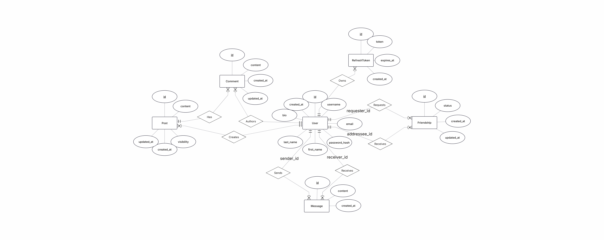
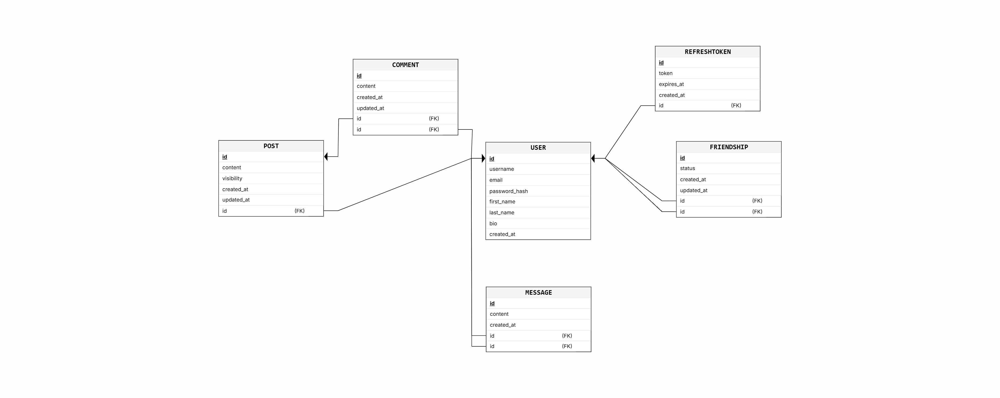

# 🔗 Linked-In Demo (Real-Time Social Network)

A professional full-stack social networking platform built with modern technologies, featuring real-time communication, personalized feeds, and containerized deployment. This project simulates a modern social network with authenticated users, a friends-only social graph, and privacy-aware content.

---

## 🌟 Features

### **Real-Time Engine**
*   **Live Updates**: Instant updates for posts and comments using **Socket.io**.
*   **Private Messaging**: Real-time one-to-one chat between friends with persistent message history.
*   **Live Notifications**: Instant feedback for friend requests and social interactions.

### **Social & Content**
*   **Dynamic Feed**: Personalized feed displaying your posts and your friends' posts only, sorted by newest first.
*   **Friendship System**: Bidirectional friend requests (Send, Accept, Reject, Remove) with no duplicate relationships.
*   **Privacy Rules**: Create posts with visibility levels: `Public`, `Friends Only`, or `Private`.
*   **Interactions**: Real-time commenting on friends' posts; only authors may edit or delete their own posts/comments.

### **Authentication & Security**
*   **Secure Auth**: User registration, login, and logout with password hashing (Bcrypt).
*   **Session Management**: JWT-based authentication featuring Access and Refresh token logic.
*   **Authorization**: Strict server-side validation ensuring users can only edit their own profiles and content.

---

## 🛠 Tech Stack

*   **Frontend**: React, **TypeScript**, **Material UI (MUI)**.
*   **Backend**: Node.js, Express, **TypeScript**.
*   **Real-Time**: Socket.io.
*   **Database**: **PostgreSQL** (Chosen for relational integrity and ACID compliance).
*   **DevOps**: Docker, Docker Compose.

---

## 📐 Database Design & Schema

The system relies on a normalized relational schema to ensure data integrity and complex relationship handling (Social Graph). 

**Key Design Decisions:**
*   **UUIDs**: Used for all primary keys to ensure global uniqueness and security.
*   **Friendship Integrity**: Implementation of a unique index using `LEAST/GREATEST` to prevent duplicate or self-referencing friendships.
*   **Cascading Deletes**: Ensuring that when a user is removed, all associated posts, comments, and messages are cleaned up.

### **ERD & Schema Diagrams**



---


## ⚙️ Installation & Setup

Follow these steps to get the project running locally using Docker.

### 1. Clone the Repository
```bash
git clone [https://github.com/TziporaShenker/Real-Time-Social-Network.git](https://github.com/TziporaShenker/Real-Time-Social-Network.git)
cd Real-Time-Social-Network
```
### 2. Configure Environment Variables
Create a `.env` file in the root directory based on the provided environment requirements. This file should include your database credentials, JWT secrets, and any other necessary configuration:

```env
# Example .env structure
DB_USER=your_user
DB_PASSWORD=your_password
DB_NAME=social_network
JWT_SECRET=your_jwt_secret
```
### 3. Run with Docker
The entire system (Frontend, Backend, and Database) is containerized for easy deployment. Using Docker ensures that the environment is consistent across all machines.

```bash
docker-compose up --build
```

### 4. Access the Application
* **Frontend**: `http://localhost:3000`
* **Backend API**: `http://localhost:5000`

---

## 📂 Project Structure
The project follows a clean and structured architecture to ensure maintainability and scalability:

```text
├── assets/             # Images, ERDs, and Screenshots
├── client/             # Frontend: React + TS + MUI
│   ├── src/
│   │   ├── api/        # Axios configuration
│   │   ├── components/
│   │   ├── context/
│   │   ├── pages/
│   │   ├── App.tsx
│   │   └── main.tsx
│   ├── Dockerfile
│   └── package.json
├── server/             # Backend: Express + Socket.io + PostgreSQL (TS)
│   ├── src/
│   │   ├── config/
│   │   ├── controllers/
│   │   ├── middlewares/
│   │   ├── models/     # SQL Queries & Data Logic
│   │   ├── routes/
│   │   └── index.ts    # Server entry point
│   ├── .env
│   ├── Dockerfile
│   └── package.json
├── database/           # Database initialization scripts
├── docker-compose.yml
├── .gitignore
└── README.md
```
